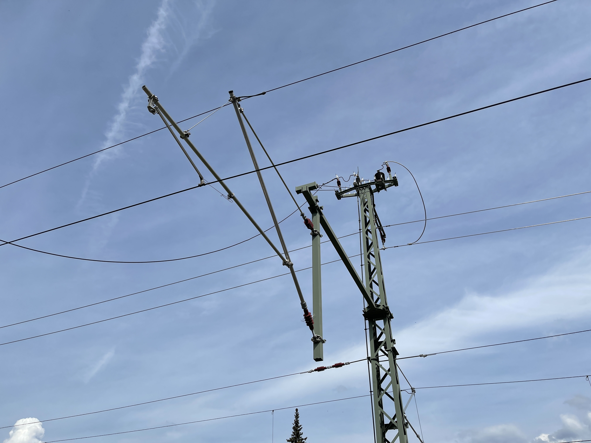
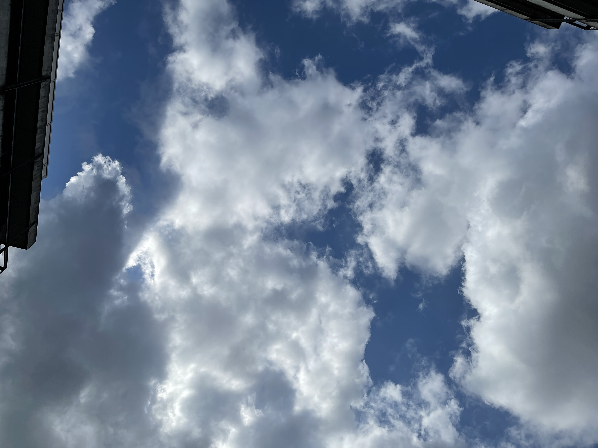
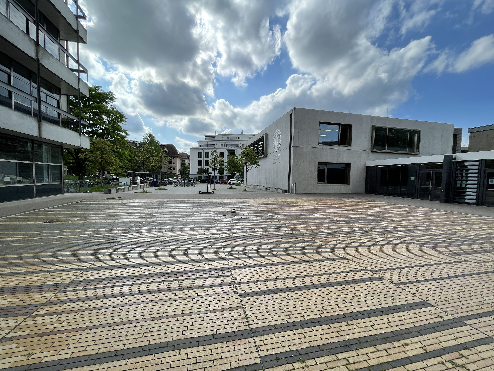
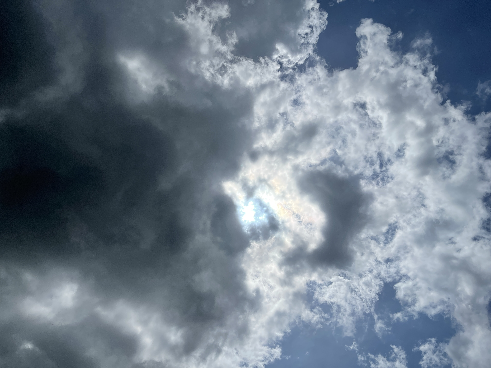
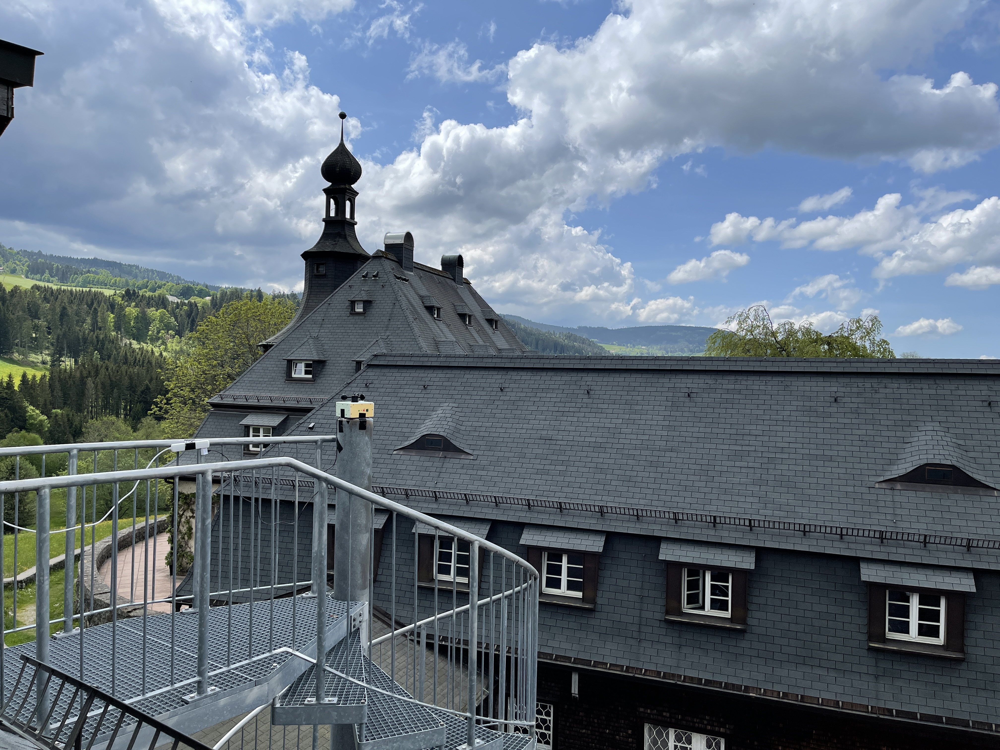
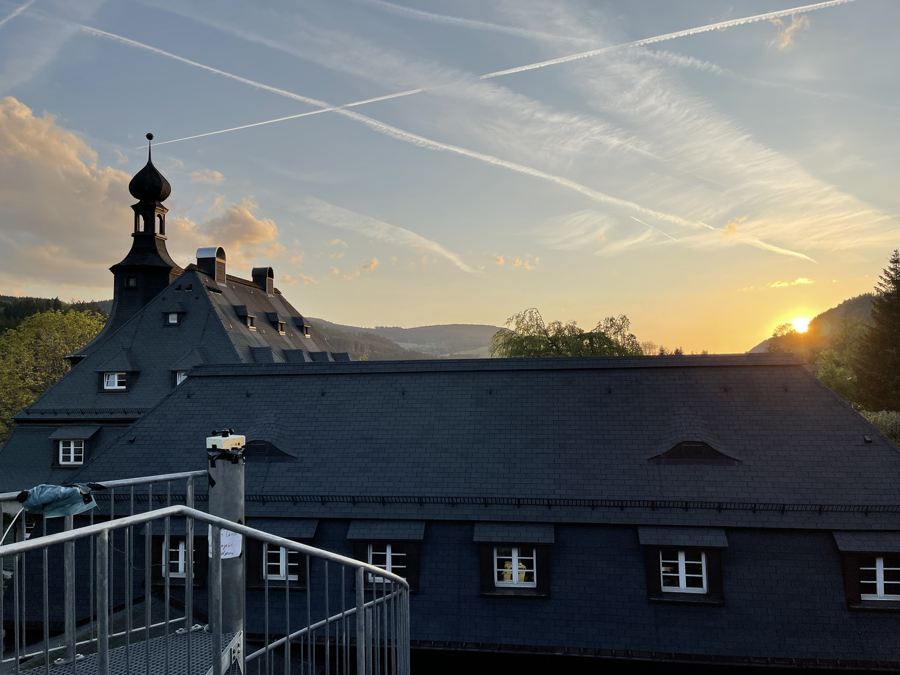

# Laborbuch Messreihen

## SenseBox Testlauf, 01.05.2022

| Beschreibung        | Wert                          |
|---------------------|-------------------------------|
| Höhe                | 890m                          |
| Ort                 | Feuertreppe Saalbau ganz oben |
| Mit Strom verbunden | 2022-05-01 13:20              |
| Valide Daten ab     | 2022-05-01 13:25              |
| Valide Daten bis    | 2022-05-01 16:25              |
| Stopp               | 2022-05-01 16:27              |
| Unique ID           | 2022-05-01-0001-FT            |

[Messreihe öffnen](../data/2022-05-01-0001-FT)

**Bemerkung:**
Beim Abholen hat nur noch die grüne LED geleuchtet und ist auch nicht ausgegangen, als der Knopf gedrückt wurde.

## Fahrradtour Vg, 03.05.2022

### Messung 1

| Beschreibung | Wert               |
|--------------|--------------------|
| Höhe         | dynamisch          |
| Unique ID    | 2022-05-03-0001-VG |

[Messreihe öffnen](../data/2022-05-03-0001-VG)

### Messung 2

| Beschreibung | Wert               |
|--------------|--------------------|
| Höhe         | dynamisch          |
| Unique ID    | 2022-05-03-0002-VG |

[Messreihe öffnen](../data/2022-05-03-0002-VG)

### Messung 3

| Beschreibung | Wert               |
|--------------|--------------------|
| Höhe         | dynamisch          |
| Unique ID    | 2022-05-03-0003-VG |

[Messreihe öffnen](../data/2022-05-03-0003-VG)

### Messung 4

| Beschreibung | Wert               |
|--------------|--------------------|
| Höhe         | dynamisch          |
| Unique ID    | 2022-05-03-0004-VG |

[Messreihe öffnen](../data/2022-05-03-0004-VG)

### Messung 5

| Beschreibung | Wert               |
|--------------|--------------------|
| Höhe         | dynamisch          |
| Unique ID    | 2022-05-03-0005-VG |

[Messreihe öffnen](../data/2022-05-03-0005-VG)

## Freiburgfahrt A, 10.05.2022

### Himmelreich

| Beschreibung        | Wert                   |
|---------------------|------------------------|
| Höhe                | 445m                   |
| Start               | 2022-05-10 15:05       |
| Temperatur          | 24°C                   |
| Wolken              | sehr leicht bewölkt    |
| AQI                 | gut                    |
| UVI                 | 4                      |
| Windgeschwindigkeit | 11 km/h                |
| Windrichtung        | Ost                    |
| Niederschlag        | 0mm in den letzten 24h |
| Gefühlte Temperatur | 24°C                   |
| Luftfeuchtigkeit    | 42%                    |
| Sicht               | perfekt                |
| Luftdruck           | 1020 hPa               |
| Luftdruck Tendenz   | fallend                |
| Ende                | 2022-05-10 15:29       |
| ID                  | 00                     |
| Unique ID           | 2022-05-10-0001-HR     |

[Messreihe öffnen](../data/2022-05-10-0001-HR)

### Freiburg-Littenweiler

| Beschreibung        | Wert                   |
|---------------------|------------------------|
| Höhe                | 318m                   |
| Start               | 2022-05-10 15:43       |
| Temperatur          | 26°C                   |
| Wolken              | leicht bewölkt         |
| AQI                 | moderat                |
| UVI                 | 4                      |
| Windgeschwindigkeit | 10 km/h                |
| Windrichtung        | Nord-Ost               |
| Niederschlag        | 0mm in den letzten 24h |
| Gefühlte Temperatur | 26°C                   |
| Luftfeuchtigkeit    | 36%                    |
| Sicht               | perfekt                |
| Luftdruck           | 1020 hPa               |
| Luftdruck Tendenz   | fallend                |
| Ende                | 2022-05-10 16:07       |
| ID                  | 02                     |
| Unique ID           | 2022-05-10-0002-LW     |

[Messreihe öffnen](../data/2022-05-10-0002-LW)

### GPS-Kontrollpunkt

| Beschreibung        | Wert                   |
|---------------------|------------------------|
| Höhe                | 240m                   |
| Start               | 2022-05-10 16:38       |
| Temperatur          | 27°C                   |
| Wolken              | leicht bewölkt         |
| AQI                 | gut                    |
| UVI                 | 1                      |
| Windgeschwindigkeit | 13 km/h                |
| Windrichtung        | Nord-Ost               |
| Niederschlag        | 0mm in den letzten 24h |
| Gefühlte Temperatur | 27°C                   |
| Luftfeuchtigkeit    | 34%                    |
| Sicht               | perfekt                |
| Luftdruck           | 1019 hPa               |
| Luftdruck Tendenz   | fallend                |
| Ende                | 2022-05-10 16:53       |
| ID                  | 03                     |
| Unique ID           | 2022-05-10-0003-KP     |

[Messreihe öffnen](../data/2022-05-10-0003-KP)

### Hinterzarten Bahnhof

| Beschreibung        | Wert                   |
|---------------------|------------------------|
| Höhe                | 885m                   |
| Start               | 2022-05-10 17:46       |
| Temperatur          | 19°C                   |
| Wolken              | leicht bewölkt         |
| AQI                 | gut                    |
| UVI                 | 1                      |
| Windgeschwindigkeit | 11 km/h                |
| Windrichtung        | Ost                    |
| Niederschlag        | 0mm in den letzten 24h |
| Gefühlte Temperatur | 19°C                   |
| Luftfeuchtigkeit    | 43%                    |
| Sicht               | perfekt                |
| Luftdruck           | 1019 hPa               |
| Luftdruck Tendenz   | fallend                |
| Ende                | 2022-05-10 18:05       |
| ID                  | 04                     | 
| Unique ID           | 2022-05-10-0004-HZ     |

[Messreihe öffnen](../data/2022-05-10-0004-HZ)

## Freiburgfahrt B, 13.05.2022

### GPS-Kontrollpunkt

| Beschreibung        | Wert                   |
|---------------------|------------------------|
| Höhe                | 240m                   |
| Start               | 2022-05-13 13:10       |
| Temperatur          | 17°C                   |
| Wolken              | bewölkt                |
| AQI                 | mäßig                  |
| UVI                 | 3                      |
| Windgeschwindigkeit | 10 km/h                |
| Windrichtung        | Süd-Ost                |
| Niederschlag        | 8mm in den letzten 24h |
| Gefühlte Temperatur | 17°C                   |
| Luftfeuchtigkeit    | 79%                    |
| Sicht               | perfekt                |
| Luftdruck           | 1022 hPa               |
| Luftdruck Tendenz   | steigend               |
| Ende                | 2022-05-13 13:29       |
| ID                  | 02                     |
| Unique ID           | 2022-05-13-0001-KP     |

[Messreihe öffnen](../data/2022-05-13-0001-KP)

### Freiburg-Littenweiler

| Beschreibung        | Wert                   |
|---------------------|------------------------|
| Höhe                | 318m                   |
| Start               | 2022-05-13 14:53       |
| Temperatur          | 19°C                   |
| Wolken              | leicht bewölkt         |
| AQI                 | mäßig                  |
| UVI                 | 4                      |
| Windgeschwindigkeit | 11 km/h                |
| Windrichtung        | Nord-Ost               |
| Niederschlag        | 9mm in den letzten 24h |
| Gefühlte Temperatur | 19°C                   |
| Luftfeuchtigkeit    | 64%                    |
| Sicht               | perfekt                |
| Luftdruck           | 1021 hPa               |
| Luftdruck Tendenz   | fallend                |
| Ende                | 2022-05-13 15:15       |
| ID                  | 03                     |
| Unique ID           | 2022-05-13-0002-LW     |

[Messreihe öffnen](../data/2022-05-13-0002-LW)

### Himmelreich

| Beschreibung        | Wert                    |
|---------------------|-------------------------|
| Höhe                | 445m                    |
| Start               | 2022-05-13 15:37        |
| Temperatur          | 20°C                    |
| Wolken              | meist bewölkt           |
| AQI                 | sehr gut                |
| UVI                 | 4                       |
| Windgeschwindigkeit | 10 km/h                 |
| Windrichtung        | Ost                     |
| Niederschlag        | 11mm in den letzten 24h |
| Gefühlte Temperatur | 20°C                    |
| Luftfeuchtigkeit    | 66%                     |
| Sicht               | perfekt                 |
| Luftdruck           | 1021 hPa                |
| Luftdruck Tendenz   | fallend                 |
| Ende                | 2022-05-13 15:50        |
| ID                  | 04                      |
| Unique ID           | 2022-05-13-0003-HR      |

[Messreihe öffnen](../data/2022-05-13-0003-HR)

### Uni Hof

48.010147, 7.857332

| Beschreibung        | Wert                   |
|---------------------|------------------------|
| Höhe                | 261m                   |
| Start               | 2022-05-13 16:47       |
| Temperatur          | 16°C                   |
| Wolken              | leicht bewölkt         |
| AQI                 | mäßig                  |
| UVI                 | 2                      |
| Windgeschwindigkeit | 10 km/h                |
| Windrichtung        | Süd-Ost                |
| Niederschlag        | 8mm in den letzten 24h |
| Gefühlte Temperatur | 17°C                   |
| Luftfeuchtigkeit    | 74%                    |
| Sicht               | perfekt                |
| Luftdruck           | 1025 hPa               |
| Luftdruck Tendenz   | steigend               |
| Ende                | 2022-05-13 16:59       |
| ID                  | 00                     |
| Unique ID           | 2022-05-13-0004-UF     |

[Messreihe öffnen](../data/2022-05-13-0004-UF)

### Uni Garten

48.009786, 7.85733

| Beschreibung        | Wert                   |
|---------------------|------------------------|
| Höhe                | 216m                   |
| Start               | 2022-05-13 17:02       |
| Temperatur          | 16°C                   |
| Wolken              | leicht bewölkt         |
| AQI                 | mäßig                  |
| UVI                 | 2                      |
| Windgeschwindigkeit | 10 km/h                |
| Windrichtung        | Süd-Ost                |
| Niederschlag        | 8mm in den letzten 24h |
| Gefühlte Temperatur | 17°C                   |
| Luftfeuchtigkeit    | 74%                    |
| Sicht               | perfekt                |
| Luftdruck           | 1025 hPa               |
| Luftdruck Tendenz   | steigend               |
| Ende                | 2022-05-13 17:47       |
| ID                  | 01                     |
| Unique ID           | 2022-05-13-0005-UF     |

[Messreihe öffnen](../data/2022-05-13-0005-UF)

### Freiburg Hbf

| Beschreibung        | Wert                   |
|---------------------|------------------------|
| Höhe                | 268m                   |
| Start               | 2022-05-13 19:05       |
| Temperatur          | 16°C                   |
| Wolken              | leicht bewölkt         |
| AQI                 | mäßig                  |
| UVI                 | 2                      |
| Windgeschwindigkeit | 10 km/h                |
| Windrichtung        | Süd-Ost                |
| Niederschlag        | 8mm in den letzten 24h |
| Gefühlte Temperatur | 17°C                   |
| Luftfeuchtigkeit    | 74%                    |
| Sicht               | perfekt                |
| Luftdruck           | 1025 hPa               |
| Luftdruck Tendenz   | steigend               |
| Ende                | 2022-05-13 19:07       |
| ID                  | 02                     |
| Unique ID           | 2022-05-13-0006-FB     |

[Messreihe öffnen](../data/2022-05-13-0006-FB)

### Fahrt

| Beschreibung | Wert               |
|--------------|--------------------|
| Höhe         | dynamisch          |
| Start        | 2022-05-13 19:10   |
| Ende         | 2022-05-13 19:23   |
| ID           | 03                 |
| Unique ID    | 2022-05-13-0007-DY |

[Messreihe öffnen](../data/2022-05-13-0007-DY)

### Kirchzarten (Schattenbedingungen!)

| Beschreibung | Wert                 |
|--------------|----------------------|
| Höhe         | 392m                 |
| Start        | 2022-05-13 19:29     |
| Ende         | 2022-05-13 ca. 19:40 |
| ID           | 04                   |
| Unique ID    | 2022-05-13-0008-KZ   |

[Messreihe öffnen](../data/2022-05-13-0008-KZ)

**Bemerkung:**
Akku leer geworden (Rekonstruktion zufolge um 19:34)

## Langer Lauf, 17.05.2022 - 18.05.2022

Position: Feuertreppe oben

### Lauf Nachmittag

| Beschreibung        | Wert                   |
|---------------------|------------------------|
| Höhe                | 890m                   |
| Start               | 2022-05-17 14:00       |
| Temperatur          | 19°C                   |
| Wolken              | leicht bewölkt         |
| AQI                 | moderat                |
| UVI                 | 0                      |
| Windgeschwindigkeit | 6 km/h                 |
| Windrichtung        | Westen                 |
| Niederschlag        | 0mm in den letzten 24h |
| Gefühlte Temperatur | 19°C                   |
| Luftfeuchtigkeit    | 57%                    |
| Sicht               | perfekt                |
| Luftdruck           | 1019 hPa               |
| Luftdruck Tendenz   | steigend               |
| Ende                | 2022-05-17 19:00       |
| ID                  | 02                     |
| Unique ID           | 2022-05-17-0001-FT     |

[Messreihe öffnen](../data/2022-05-17-0001-FT)

**Bemerkung:**
vor 19:00 Blinken aufgehört

### Lauf Nacht

| Beschreibung        | Wert                   |
|---------------------|------------------------|
| Höhe                | 890m                   |
| Start               | 2022-05-17 19:00       |
| Temperatur          | 19°C                   |
| Wolken              | leicht bewölkt         |
| AQI                 | moderat                |
| UVI                 | 0                      |
| Windgeschwindigkeit | 6 km/h                 |
| Windrichtung        | Westen                 |
| Niederschlag        | 0mm in den letzten 24h |
| Gefühlte Temperatur | 19°C                   |
| Luftfeuchtigkeit    | 57%                    |
| Sicht               | perfekt                |
| Luftdruck           | 1019 hPa               |
| Luftdruck Tendenz   | steigend               |
| Ende                | 2022-05-18 ca. 03:30   |
| ID                  | 03                     |
| Unique ID           | 2022-05-17-0002-FT     |

[Messreihe öffnen](../data/2022-05-17-0002-FT)

**Bemerkung:**
Rekonstruktion zufolge bis 03:27;
Dateien für Logger geteilt in 03A und 03B (wegen Limit von Dateigrößen auf GitHub).

